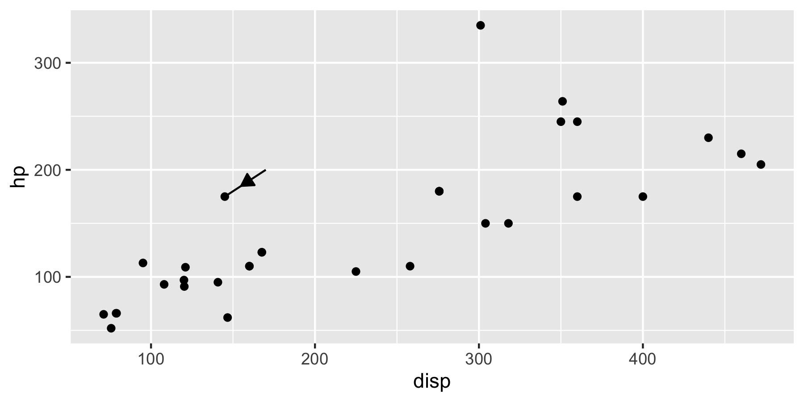
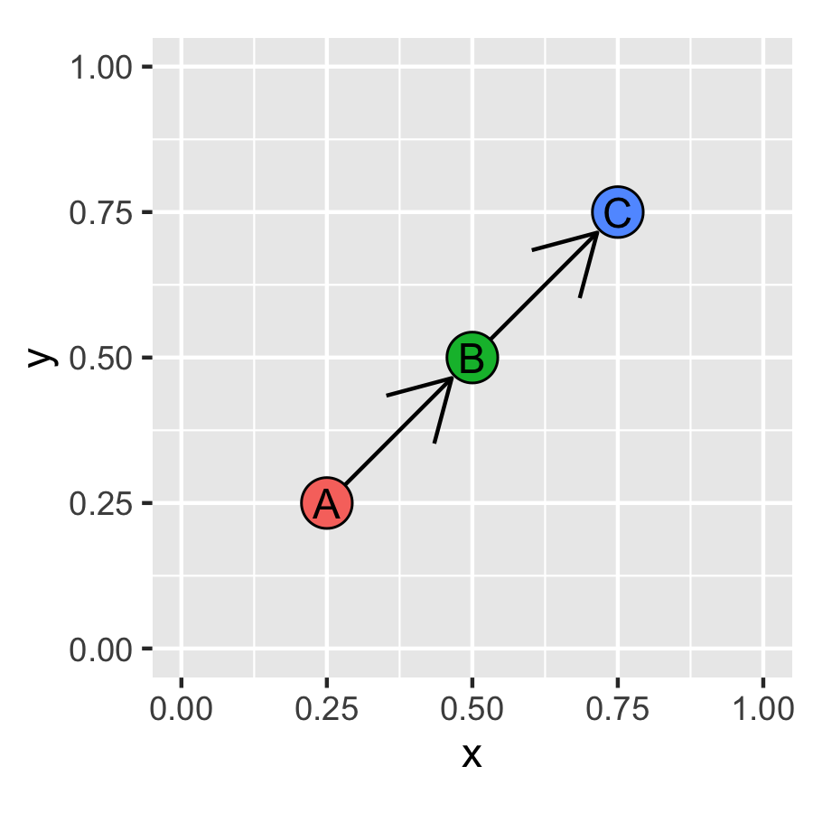

# ggarchery: Flexible segment geoms with arrows for ggplot2


ggarchery is intended to extend [ggplot2](https://github.com/tidyverse/ggplot2)'s handling of segments with arrowheads. At present it contains one geom and one position adjustment.

## `geom_arrowsegment()` allows placement of one or more arrowheads at any point on a segment

First, let's generate some data that would be understood by [ggplot2](https://github.com/tidyverse/ggplot2)'s normal `geom_segment()`:

```
library(tidyverse)
library(ggarchery)

tbl <- tibble(x = c(0.1, 0.2), xend = c(0.1, 0.8), y = c(0.1, 0.5), yend = c(0.7, 0.9))
```

The default behaviour of `geom_arrowsegment()` mimics that of `geom_segment(arrow = arrow())`

```
ggplot(tbl) + 
  geom_segment(aes(x = x, xend = xend, y = y, yend = yend), arrow = arrow()) + 
  xlim(c(0,1)) +
  ylim(c(0,1))
```


```
ggplot(tbl) + 
  geom_arrowsegment(aes(x = x, xend = xend, y = y, yend = yend)) + 
  xlim(c(0,1)) +
  ylim(c(0,1))
```


The `arrows` parameter of `geom_arrowsegment()` also behaves exactly like the `arrow` parameter of `geom_segment`, as a call to `grid::arrow()`:

```
ggplot(tbl) + 
  geom_arrowsegment(aes(x = x, xend = xend, y = y, yend = yend), arrows = arrow(type = 'closed')) + 
  xlim(c(0,1)) +
  ylim(c(0,1))
```


Now for the interesting bit. Suppose that we would like the arrowhead to appear at the midpoint of the segment, rather than the end. This can be done by specifying `arrow_positions = 0.5`.

```
ggplot(tbl) + 
  geom_arrowsegment(aes(x = x, xend = xend, y = y, yend = yend), arrow_positions = 0.5) + 
  xlim(c(0,1)) +
  ylim(c(0,1))
```


Control of the arrow segment works as before:

```
ggplot(tbl) + 
  geom_arrowsegment(aes(x = x, xend = xend, y = y, yend = yend), 
                    arrow_positions = 0.5, 
                    arrows = arrow(type = 'closed')) + 
  xlim(c(0,1)) +
  ylim(c(0,1))
```


Other aesthetics also work as you would hope:

```
tbl <- tbl %>% mutate(col = c("A", "B"))

ggplot(tbl) + 
  geom_arrowsegment(aes(x = x, xend = xend, y = y, yend = yend, col = col), arrow_positions = 0.5)  + 
  xlim(c(0,1)) +
  ylim(c(0,1))
```


You can also define multiple arrowheads by making `arrow_positions` a vector of length greater than 1. All values are expected to fall between 0 and 1, and not be exactly 0:

```
ggplot(tbl) + 
  geom_arrowsegment(aes(x = x, xend = xend, y = y, yend = yend), arrow_positions = c(0.25, 0.75))  + 
  xlim(c(0,1)) +
  ylim(c(0,1))
```


If one value is 1, then the final arrowhead appears at the end:

```
ggplot(tbl) + 
  geom_arrowsegment(aes(x = x, xend = xend, y = y, yend = yend), arrow_positions = c(0.25, 1))  + 
  xlim(c(0,1)) +
  ylim(c(0,1))
```


The look of each arrow can also be controlled separately by making `arrows` a list:

```
ggplot(tbl) + 
  geom_arrowsegment(aes(x = x, xend = xend, y = y, yend = yend), arrow_positions = c(0.25, 1), 
                    arrows = list(arrow(angle = 10), arrow(type = 'closed')))  + 
  xlim(c(0,1)) +
  ylim(c(0,1))
```


The `arrow_fills` option also mimics `arrow.fill` of `geom_segment()` but can be a vector.

```
ggplot(tbl) + 
  geom_arrowsegment(aes(x = x, xend = xend, y = y, yend = yend), 
                    arrow_positions = c(0.25, 1), 
                    arrow_fills = c("indianred3", "dodgerblue3"), 
                    arrows = arrow(type = "closed"))  + 
  xlim(c(0,1)) +
  ylim(c(0,1))
```


Finally, the geom can be used as an annotation:

```
ggplot(mtcars) + 
  geom_point(aes(x = disp, y=hp)) + 
  annotate(geom = "arrowsegment", 
           x = 170, 
           y=200, 
           xend = 145, 
           yend = 175, 
           arrow_positions = 0.6, 
           arrows = arrow(type = "closed", length = unit(0.1, "inches")))
```



## `position_attractsegment()` allows you to automatically shave the ends of arrow segments

`position_attractsegment()` is intended to solve the following problem. Suppose you have nicely laid out a set of labelled points:

```
pt.tbl <- tibble(x = c(0.25, 0.5, 0.75), y = c(0.25, 0.5, 0.75), labels = c("A", "B", "C"))

ggplot(pt.tbl) + 
  geom_point(aes(x,y, fill = labels), size =6, shape = 21) +
  geom_text(aes(x,y, label = labels)) +
  xlim(c(0, 1)) +
  ylim(c(0, 1)) +
  scale_fill_discrete(guide = "none")
```


If you wish to connect these points using geom_segment() with an arrow, the output is a little ugly, as the lines intersect the points:

```
sg.tbl <- tibble(x = c(0.25, 0.5), y = c(0.25, 0.5), xend = c(0.5, 0.75), yend = c(0.5, 0.75))

ggplot(pt.tbl) + 
  geom_point(aes(x,y, fill = labels), size =6, shape = 21) +
  geom_text(aes(x,y, label = labels)) +
  geom_segment(data = sg.tbl, 
               aes(x = x, xend = xend, y = y, yend = yend), 
               arrow = arrow()) +
  xlim(c(0, 1)) +
  ylim(c(0, 1)) +
  scale_fill_discrete(guide = "none")
```


`position_attractsegment()` works by shortening the segment at the start and the end (by "attracting" the start and end points towards each other). It can do this in two ways, as determined by the `type_shave` option. If `type_shave = "proportion"` (the default), then it takes the proportions `start_shave` and `end_shave` away:

```
ggplot(pt.tbl) + 
  geom_point(aes(x,y, fill = labels), size =6, shape = 21) +
  geom_text(aes(x,y, label = labels)) +
  geom_segment(data = sg.tbl, 
               aes(x = x, xend = xend, y = y, yend = yend), 
               arrow = arrow(), 
               position = position_attractsegment(start_shave = 0.1, end_shave = 0.1)) +
  xlim(c(0, 1)) +
  ylim(c(0, 1)) +
  scale_fill_discrete(guide = "none")
```


Alternatively, if type_shave = "distance" then the amount removed is in graph units. This allows for finer control, but has strange effects if the dimensions of the x and y axes are not the same and is only really recommended in combination with `coord_fixed()`.

```
ggplot(pt.tbl)+
  geom_segment(data = sg.tbl, aes(x = x, xend = xend, y = y, yend = yend), arrow = arrow(), 
               position = position_attractsegment(start_shave = 0, end_shave = 0.05, type_shave = "distance")) +
  geom_point(aes(x,y, fill = labels), size =6, shape = 21) +
  geom_text(aes(x,y, label = labels))  +
  xlim(c(0, 1)) +
  ylim(c(0, 1)) +
  scale_fill_discrete(guide = "none") +
  coord_fixed()
```



(Note here we shaved only the end of the segment, and drew the segment first.)

`geom_arrowsegment()` and `position_attractsegment()` can naturally be used in combination:

```
ggplot(pt.tbl)+
  geom_arrowsegment(data = sg.tbl, aes(x = x, xend = xend, y = y, yend = yend), 
                    arrow_positions = 0.6, 
                    arrows = arrow(length = unit(0.1, "inches")), 
                    position = position_attractsegment(start_shave = 0, 
                                                       end_shave = 0.05, 
                                                       type_shave = "distance")) +
  geom_point(aes(x,y, fill = labels), size =6, shape = 21) +
  geom_text(aes(x,y, label = labels))  +
  xlim(c(0, 1)) +
  ylim(c(0, 1)) +
  scale_fill_discrete(guide = "none") +
  coord_fixed()
```


## Limitations

Current these replace only `geom_segment()` and work only for linear coordinate systems. I would like to extend to `geom_curve()` but the intricacies of `grid::curveGrob()` make that much more complicated. I am unsure if allowing these for the `geom_line()` and `geom_path()` parameterisations would be especially useful, but I'm happy to be told they would be.
